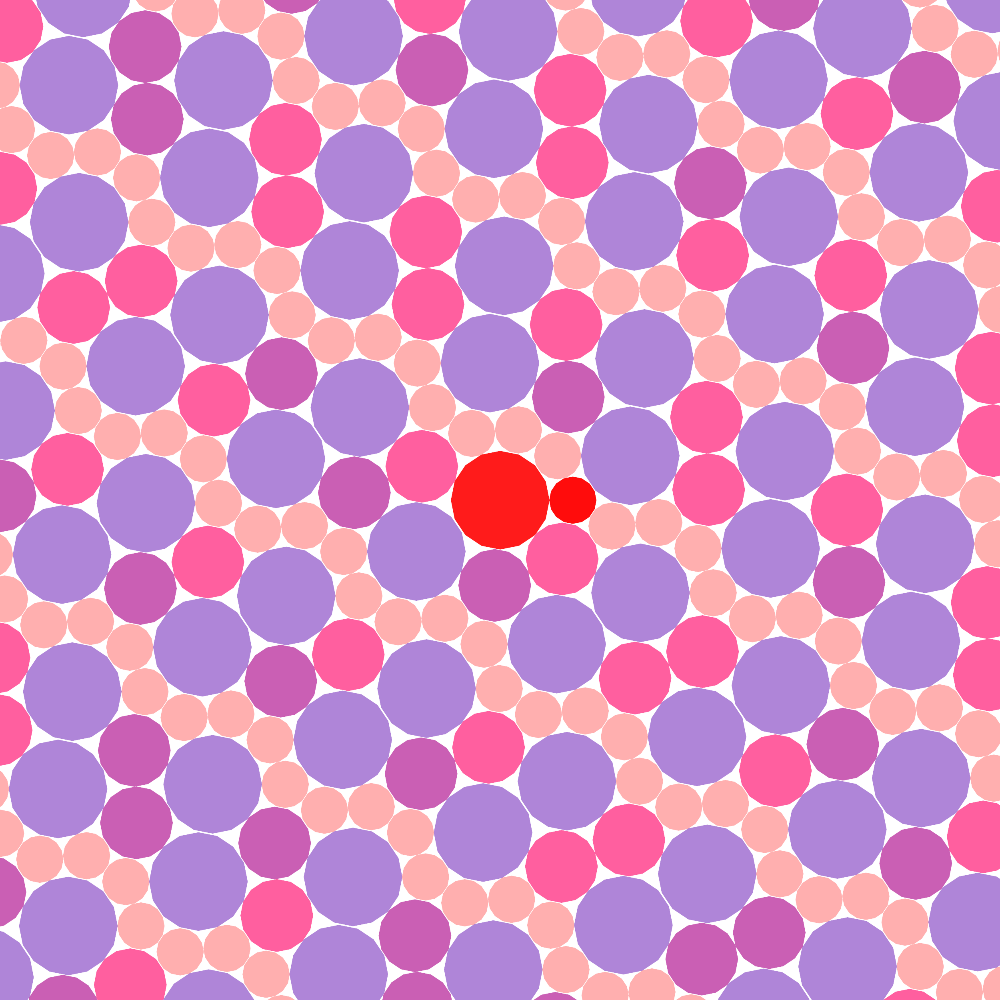

# diskpack: Algorithms for Compact Disk Packings

C++ library for finding radius configurations that admit compact disk packings on the plane. Implements interval arithmetic and computational geometry methods.


  <!--  -->
  

<div style="display: flex; align-items: center;">
  
  <div style="flex: 50%; padding: 5px;">

## 📖 About
The initial goal is to investigates the problem of finding radius triples `(r, s, t)` where disk packings with radii `{1, r, s, t}` exist such that:
- The contact graph is a triangulation
- All uncovered regions are curvilinear triangles

Some examples of packings can be seen in ``/images``

Relevance:
- Connects to aperiodic packing problems (Wang tiles)
- Applications in materials science and crystallography

  </div>
  <div style="flex: 20%; padding: 5%;">

  <!--  -->
  
  
  </div>
</div>

For a more detailed overview see ``/docs`` [in Russian]


Related papers:

- **Likos, C. N., & Henley, C. L.** (1992). *Complex alloy phases for binary hard-disc mixtures*. [Philosophical Magazine B](https://www.tandfonline.com/doi/abs/10.1080/13642819308215284)  
- **Daumas, M., Melquiond, G., & Munoz, C.** (2005). *Guaranteed proofs using interval arithmetic*. [IEEE](https://ieeexplore.ieee.org/document/1467639).
- **Kennedy, T.** (2004). *Compact packings of the plane with two sizes of discs*. [arXiv](https://arxiv.org/abs/math/0407145).  
- **Fernique, T., Hashemi, A., & Sizova, O.** (2020). *Compact packings of the plane with three sizes of discs*. [arXiv](https://arxiv.org/abs/1810.02231).  
- **Fernique, T.** (2023). *Packing unequal disks in the Euclidean plane*. [arXiv](https://arxiv.org/abs/2305.12919).
- **Messerschmidt, M.** (2022). *The number of configurations of radii that can occur in compact packings of the plane with discs of n sizes is finite*. [arXiv](https://arxiv.org/abs/2110.15831).  

## ⚙️ Features
- **Interval Search Engine**  
  Guaranteed testing of ε-neighborhoods in `(0,1)³` without false negatives
- **Packing Generator**  
  Constructs contact graphs with precision control
- **Parallel Computation**  
  Optimized parameter space processing

## 🚀 Building and Running
**Dependencies:**
- C++17 compatible compiler
- libboost
- nlohmann-json3

To get started, run the following commands from the root directory:
```bash
$ sudo apt-get install nlohmann-json3-dev
$ sudo apt install libboost-all-dev
$ ./build.sh
```

## visualizer
The visualizer generates a compact disk packing with some radii set from a given region. To use it, run the following commands:
```bash
$ cd build
$ make visualizer
$ ./visualizer --help
```

This will display a detailed description of the command-line interface. The ``svg`` image of the generated packing are located in ``images`` folder.

## finder
The finder identifies all of the small subregions within a given region which contain a radii set that allows a compact disk packing. To display the CLI description, run these commands:

```bash
$ cd build
$ make finder
$ ./finder --help
```